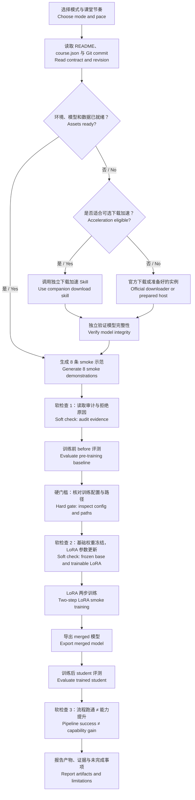

# Distillation Lab Coach

师生共用的知识蒸馏实验 Agent Skill / A shared Agent Skill for teaching and running a knowledge-distillation lab

[中文](#中文) · [English](#english) · [实验流程 / Workflow](#实验流程--workflow)

## 中文

### 它解决什么问题

`distillation-lab-coach` 面向公开课程仓库 [Beirana/distill-course](https://github.com/Beirana/distill-course)，帮助教师和学生共同完成 Qwen2.5 教师文本蒸馏实验。它既能讲解概念和文件，也能通过宿主 Agent 已有的终端与 SSH 能力分阶段执行 smoke 实验，并在故障时保留证据、切换课堂备用路线。

它不会把实验变成一个不可见的“一键脚本”。它始终区分：

- 当前阶段的输入、动作、输出和验证证据；
- smoke 流程验证与正式效果证据；
- 教师文本蒸馏与 logits/KL 蒸馏；
- LoRA adapter 与合并后的完整模型；
- 学习检查点与真正需要阻止继续的实验硬门槛。

### 四种主要使用方式

| 模式 | 用途 | 是否等待学生回答 |
|---|---|---|
| 课堂引导 | 教师带全班完成 smoke，保留三个微检查 | 最多 20–45 秒；答不上时提示并继续 |
| 快速执行 | 优先完成实验，同时保留阶段证据 | 不等待，问题和答案同时显示 |
| 自由问答 | 解释概念、命令、文件和结果 | 不进入执行检查点 |
| 故障诊断 | 根据阶段、日志、退出码和产物定位问题 | 只在硬门槛或风险处停止 |

教师控场是公开的讲解视角，不是私有角色或额外权限。学生可以看到并使用这些说明；教师私密实例、账号、备用安排和内部评价不进入本仓库。

## 实验流程 / Workflow



### 快速开始

自然语言调用即可，具体调用语法取决于 Agent 宿主：

```text
使用 distillation-lab-coach，采用课堂引导模式。
SSH 主机别名是 autodl-course，run ID 是 smoke-group-03。
先检查环境和实验契约，再从 smoke 开始；达到软检查时用中文提问。
```

教师临场可以这样问：

```text
使用 distillation-lab-coach 教师控场模式。
学生刚完成 generate，这一步我应该展示哪个文件？请给我一段 30 秒中文口播。
```

更多示例见 [examples/prompts.md](examples/prompts.md)。

### 可选伴随 Skill：模型并行下载

[model-download-accelerator](https://github.com/Beirana/model-download-accelerator) 作为可选的课前能力接入，不是本实验的强制依赖。调用前必须先确认：

1. 模型是否已经完整存在；存在就不重复下载。
2. 来源是否满足下载加速 Skill 的 Provider 资格合同。
3. 是否有固定 revision、完整文件清单、稳定直链、Range 行为与完整性依据。
4. 并发下载是否真的提高持续吞吐，并且没有增加 403/429、重试风暴或存储瓶颈。

当前公开版下载加速器主要支持公开 Hugging Face 兼容来源，尚未宣称 ModelScope 已支持。`distill-course` 当前模型下载以 ModelScope 为主，因此在完成 Provider 资格验证之前，应继续使用课程仓库官方流程或课前准备好的实例。详见 [references/optional-download-acceleration.md](references/optional-download-acceleration.md)。

### 安装与可移植性

本仓库核心不调用 Codex、OpenAI、Claude 或其他特定 Agent API。宿主只要能够读取 Skill、访问终端，并在获得相应权限后使用 SSH，就可以采用相同流程。

| 宿主 | 用户级位置 | 项目级位置 |
|---|---|---|
| Codex | `~/.codex/skills/distillation-lab-coach/` | 按项目配置放入可发现的 skills 目录 |
| Claude Code | `~/.claude/skills/distillation-lab-coach/` | `.claude/skills/distillation-lab-coach/` |
| 其他兼容宿主 | 使用宿主文档指定的 skills 目录 | 使用宿主文档指定的项目技能目录 |

`agents/openai.yaml` 只是可选界面元数据。忽略或移除它不会改变 Skill 的实验流程。完整边界见 [references/compatibility.md](references/compatibility.md)。

### 仓库结构

```text
distillation-lab-coach/
├── SKILL.md
├── README.md
├── LICENSE
├── agents/
│   └── openai.yaml
├── examples/
│   └── prompts.md
└── references/
    ├── stages.md
    ├── files.md
    ├── teacher-mode.md
    ├── troubleshooting.md
    ├── compatibility.md
    └── optional-download-acceleration.md
```

## English

### What it does

`distillation-lab-coach` is a shared teacher-and-student Agent Skill for the public [Beirana/distill-course](https://github.com/Beirana/distill-course) lab. It explains concepts and artifacts, orchestrates the smoke workflow through terminal and SSH capabilities supplied by the host agent, and preserves evidence when the class needs to switch to a fallback.

The skill supports guided classroom pacing, fast execution, open questions, teacher-facing explanations, and stage-aware diagnosis. Its three learning checks are short and non-blocking. Hard gates remain blocking when continuing would overwrite a run, use the wrong experiment contract, skip training-input inspection, touch the final test, or expose unrelated credentials/data/processes.

### Optional download companion

[model-download-accelerator](https://github.com/Beirana/model-download-accelerator) is an optional pre-class companion, not a dependency. Invoke it only after checking source eligibility and only when models are not already complete. Its current public scope primarily covers public Hugging Face-compatible sources and does not claim ModelScope support. The course must therefore keep its official ModelScope path until the provider contract has been satisfied and tested.

No speedup claim is made here. Measure cold-file sustained throughput, failures, retries, and final integrity before reporting an efficiency improvement.

### Portability

The core `SKILL.md` and `references/` do not call a specific agent-host API. `agents/openai.yaml` is optional presentation metadata for Codex/OpenAI hosts. Other hosts may ignore it. Host compatibility should be claimed only after testing skill discovery, instruction loading, terminal/SSH permissions, and approval behavior.

## License

MIT
