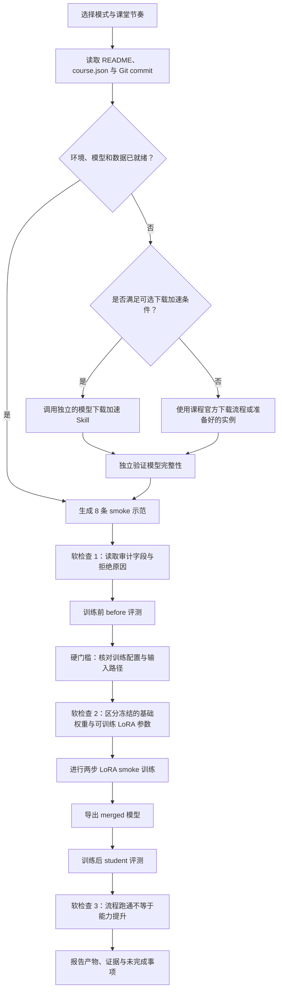

# 蒸馏实验助教

面向教师和学生的知识蒸馏实验 Agent Skill。

## 它解决什么问题

`distillation-lab-coach` 面向公开课程仓库 [Beirana/distill-course](https://github.com/Beirana/distill-course)，帮助教师和学生共同完成 Qwen2.5 教师文本蒸馏实验。它可以讲解概念和文件，也可以通过宿主 Agent 已有的终端与 SSH 能力分阶段执行 smoke 实验，并在故障时保留证据、切换课堂备用路线。

它不会把实验变成一个不可见的“一键脚本”。它始终区分：

- 当前阶段的输入、动作、输出和验证证据；
- smoke 流程验证与正式效果证据；
- 教师文本蒸馏与 logits/KL 蒸馏；
- LoRA adapter 与合并后的完整模型；
- 学习检查点与真正需要阻止继续的实验硬门槛。

`README.md` 面向人阅读，因此以中文介绍用途、安装和课程流程；`SKILL.md` 面向 Agent 加载，因此采用英文编写执行规则。Agent 与中文用户交流时仍应使用中文。

## 主要使用方式

| 模式 | 用途 | 是否等待学生回答 |
|---|---|---|
| 课堂引导 | 教师带全班完成 smoke，保留三个微检查 | 最多 20–45 秒；答不上时提示并继续 |
| 快速执行 | 优先完成实验，同时保留阶段证据 | 不等待，问题和答案同时显示 |
| 自由问答 | 解释概念、命令、文件和结果 | 不进入执行检查点 |
| 故障诊断 | 根据阶段、日志、退出码和产物定位问题 | 只在硬门槛或风险处停止 |

教师控场是公开的讲解视角，不是私有角色或额外权限。学生可以看到并使用这些说明；教师私密实例、账号、备用安排和内部评价不进入本仓库。

## 实验流程



## 快速开始

具体调用语法取决于 Agent 宿主，可以直接使用自然语言：

```text
使用 distillation-lab-coach，采用课堂引导模式。
SSH 主机别名是 autodl-course，run ID 是 smoke-group-03。
先检查环境和实验契约，再从 smoke 开始；达到软检查时用中文提问。
```

教师临场可以这样问：

```text
使用 distillation-lab-coach 教师控场模式。
学生刚完成 generate，这一步我应该展示哪个文件？请给我一段 30 秒中文口播。
```

更多示例见 [examples/prompts.md](examples/prompts.md)。

## 可选伴随 Skill：模型并行下载

[model-download-accelerator](https://github.com/Beirana/model-download-accelerator) 是可选的课前能力，不是本实验的依赖，也不会自动替代课程原有的模型下载流程。调用前需要确认：

1. 模型是否已经完整存在；存在就不重复下载。
2. 来源是否满足下载加速 Skill 的 Provider 资格合同。
3. 是否有固定 revision、完整文件清单、稳定直链、已探测的 Range 行为与完整性依据。
4. 并发下载是否真正提高持续吞吐，并且没有带来更多 403/429、重试风暴或存储瓶颈。

当前公开版下载加速器主要支持公开的 Hugging Face 兼容来源，尚未宣称支持 ModelScope。`distill-course` 当前主要通过 ModelScope 获取模型，因此在完成 Provider 资格验证和实测之前，应继续使用课程仓库的官方流程或课前准备好的实例。

本仓库暂不声明具体加速倍数。实测时应在相同模型、固定 revision 和相近网络条件下，对比总耗时、持续吞吐、失败与重试次数以及最终文件完整性。详细决策条件和记录模板见 [references/optional-download-acceleration.md](references/optional-download-acceleration.md)。

## 安装与可移植性

本仓库核心不调用 Codex、OpenAI、Claude 或其他特定 Agent API。宿主只要能够读取 Skill、访问终端，并在获得相应权限后使用 SSH，就可以采用相同流程。

| 宿主 | 用户级位置 | 项目级位置 |
|---|---|---|
| Codex | `~/.codex/skills/distillation-lab-coach/` | 按项目配置放入可发现的 skills 目录 |
| Claude Code | `~/.claude/skills/distillation-lab-coach/` | `.claude/skills/distillation-lab-coach/` |
| 其他兼容宿主 | 使用宿主文档指定的 skills 目录 | 使用宿主文档指定的项目技能目录 |

`agents/openai.yaml` 只是可选的界面元数据。忽略或移除它不会改变 Skill 的实验流程。兼容性边界见 [references/compatibility.md](references/compatibility.md)。

## 仓库结构

```text
distillation-lab-coach/
├── SKILL.md                       # 供 Agent 加载的英文指令
├── README.md                      # 面向教师和学生的中文说明
├── LICENSE
├── agents/
│   └── openai.yaml               # 可选宿主元数据
├── examples/
│   └── prompts.md                 # 面向使用者的中文调用示例
└── references/
    ├── stages.md                  # 以下均为供 Agent 按需加载的英文资料
    ├── files.md
    ├── teacher-mode.md
    ├── troubleshooting.md
    ├── compatibility.md
    └── optional-download-acceleration.md
```

## 许可证

MIT
