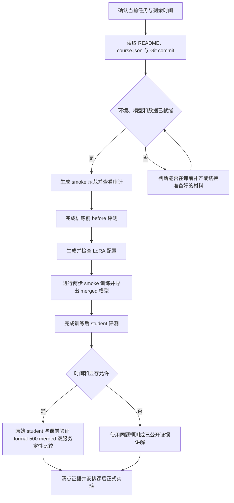

# 蒸馏实验助教

`distillation-lab-coach` 是沿同一条实验主线工作的知识蒸馏 Agent Skill。所有使用者共用相同流程。Skill 会根据当前任务、剩余时间和已经取得的证据，选择合适的讲解深度与执行节奏。

> 完整中文指令镜像见 [SKILL.zh-CN.md](SKILL.zh-CN.md)，供人工通读。Agent 发现、加载和执行时仍以英文 [SKILL.md](SKILL.md) 为唯一权威入口。两者出现差异时，以英文版为准。

## 它解决什么问题

本 Skill 面向公开课程仓库 [Beirana/distill-course](https://github.com/Beirana/distill-course)，用于讲解、执行和诊断教师文本蒸馏实验。它可以通过宿主 Agent 已有的终端与 SSH 能力分阶段运行 smoke，也可以解释 LoRA 配置、运行产物、训练前后结果和正式实验边界。

当前内容按 `distill-course` 提交 `d7761de6a58b3d0566cdde57797bd70ecd3f9c3b` 校对。这个提交是现阶段的测试基线，不是永久版本锁。实际运行前仍要读取当前 checkout 的 README、`configs/course.json` 和 Git 提交；若采用其他模型、路径或资源参数，应把差异记录为适配运行。

这个 Skill 不把实验藏进一个看不见的一键脚本。它始终区分下面几件事。

- 当前阶段的输入、动作、输出和验证证据
- smoke 流程验证与正式效果证据
- 教师文本蒸馏与 logits 或 KL 蒸馏
- LoRA adapter 与合并后的完整模型
- 学习检查与真正需要暂停执行的实验门槛

## 按任务和节奏选择路线

| 路线 | 适用任务 | 运行方式 |
|---|---|---|
| 课堂引导 | 在有限课时内完成 smoke，并保留少量理解检查 | 分阶段推进，短暂等待回答，必要时提示后继续 |
| 快速执行 | 优先跑通当前 smoke 或恢复中断阶段 | 连续执行安全步骤，问题与答案同时展示，硬门槛仍然生效 |
| 讲解展示 | 准备口播、解释文件、展示命令或组织双服务定性比较 | 先给可直接使用的讲解，再指出展示入口和时间边界 |
| 自由问答 | 理解概念、命令、配置、文件和结果 | 直接回答眼前问题，不强制进入执行流程 |
| 故障诊断 | 处理报错、缺少产物、进程停滞或结果冲突 | 先确认阶段、退出码与现有证据，再给最小修复动作 |
| 课后正式 | 完成 500 条示范及后续训练、评测、冻结和报告 | 使用新的正式 run，保留完整审计，不延用课堂 smoke run |

这些路线只改变节奏和回答形态，不改变权限。任何使用者都沿同一条实验状态机前进，也都要遵守相同的凭据边界、运行隔离和证据要求。

课堂节奏与展示方法见 [references/classroom-support.md](references/classroom-support.md)。生成端、训练端和硬件适配见 [references/environments.md](references/environments.md)。本地 Agent 尚未建立可验证的 SSH 主机别名时，再读取 [references/ssh-onboarding.md](references/ssh-onboarding.md)。

## 课堂主线



smoke 使用少量示范和很少的训练步数。它能证明各阶段可以依次工作，不能单独证明模型能力提高。正式效果需要使用可追溯的 500 条运行、同协议评测和完整报告。

## 快速开始

具体调用方式由 Agent 宿主决定。支持 Skill 显式调用的宿主可以直接使用下面的自然语言请求。

```text
使用 $distillation-lab-coach，采用课堂引导路线。
SSH 主机别名是 autodl-course，run ID 是 smoke-group-03。
先检查仓库、实验配置和已有产物，再从尚未完成的阶段继续。
```

需要加快节奏时可以这样说。

```text
使用 $distillation-lab-coach，切换到快速执行路线。
保留所有实验门槛和阶段证据，不等待理解检查的回答。
```

需要准备课堂说明时可以这样说。

```text
使用 $distillation-lab-coach 的讲解展示路线。
当前刚完成示范生成。请给一段 30 秒中文讲解、一个展示文件和下一步的时间边界。
```

更多请求写法见 [examples/prompts.md](examples/prompts.md)。

## 可选的模型下载加速

[model-download-accelerator](https://github.com/Beirana/model-download-accelerator) 是可选的课前能力，不是本实验的依赖，也不会自动替代课程原有下载流程。调用前需要先确认模型是否已经完整存在，再检查来源是否满足下载加速 Skill 的 Provider 资格合同。

当前 `distill-course` 主要通过 ModelScope 获取模型。下载加速器尚未声明支持 ModelScope，因此在 Provider 资格验证和真实实例计时完成以前，课程仍应使用公开仓库提供的下载流程、已经校验的镜像或课前准备好的模型。

本 Skill 暂不声明具体加速倍数。实测应固定模型与 revision，并记录总耗时、持续吞吐、失败与重试次数以及最终文件完整性。详细条件和记录模板见 [references/optional-download-acceleration.md](references/optional-download-acceleration.md)。

## 公开证据边界

公开 `distill-course` 仓库提供其中已经提交的代码、配置和课程材料。本地正式运行归档、备课材料、交互动画、录屏和视频素材目前不随该公开仓库分发。

Skill 在看不到这些材料时，只能使用当前运行产物和公开仓库中真实存在的文件。它不能声称已经读取本地归档，也不能把留档数字写成本组现场结果。未来若公开正式证据包，应同时提供唯一 run、代码提交、配置、summary、原始预测和文件清单，并在本 README 中加入真实可访问的链接。

## 安装与可移植性

当前开发远端是 private 仓库 [Beirana/distillation-lab-coach](https://github.com/Beirana/distillation-lab-coach)，只有获得授权的 GitHub 账号才能访问。它还不是公开 release。已获得权限的使用者可以克隆完整仓库。

```bash
git clone https://github.com/Beirana/distillation-lab-coach.git
```

仓库转为公开并建立稳定 release 或 tag 后，再把课程对外入口固定到对应版本。

使用现有副本时，应把完整的 `distillation-lab-coach` 目录放入宿主能够发现的 Skill 目录，并保持仓库目录名、Skill 目录名和 `SKILL.md` 中的 `name` 一致。不要只复制 `SKILL.md`，否则按需引用的资料和示例会缺失。

完整安装可以保留 `SKILL.zh-CN.md`，但不要只复制或安装中文镜像，也不要把它配置成发现入口。部分第三方宿主可能采用非标准扫描规则，正式声明兼容以前仍要验证它是否只加载精确的 `SKILL.md`。

| 宿主 | 用户级目标位置 | 项目级目标位置 |
|---|---|---|
| Codex | `~/.codex/skills/distillation-lab-coach/` | 以当前 Codex 项目配置和官方说明为准 |
| Claude Code | `~/.claude/skills/distillation-lab-coach/` | `.claude/skills/distillation-lab-coach/` |
| 其他兼容宿主 | 使用该宿主文档规定的 Skill 目录 | 使用该宿主文档规定的项目目录 |

目录布局相似不能证明宿主兼容。正式声明支持某个宿主以前，需要实际验证 Skill 发现、指令加载、终端与 SSH 权限以及审批行为。`agents/openai.yaml` 只提供可选界面元数据，忽略它不会改变实验流程。进一步说明见 [references/compatibility.md](references/compatibility.md)。

课程项目应把这个独立仓库作为唯一发布源，避免再维护一份复制内容。当前课程目录保留相对链接，方便离线备课，同时注明 private 开发远端。仓库公开并建立稳定 release 后，课程 README 可以链接对应 release 或 tag。需要离线固定版本的 Git 项目可以再评估正式 submodule；普通课程入口使用链接更简单。

## 仓库结构

```text
distillation-lab-coach/
├── SKILL.md
├── SKILL.zh-CN.md
├── README.md
├── LICENSE
├── agents/
│   └── openai.yaml
├── examples/
│   └── prompts.md
└── references/
    ├── stages.md
    ├── files.md
    ├── classroom-support.md
    ├── environments.md
    ├── ssh-onboarding.md
    ├── troubleshooting.md
    ├── compatibility.md
    └── optional-download-acceleration.md
```

`README.md` 提供项目总览，`SKILL.zh-CN.md` 供人工完整通读，英文 `SKILL.md` 和 `references/` 供 Agent 按需加载。中文镜像不增加独立规则。每次修改英文主入口时，应在同一提交中同步中文镜像；若暂时无法同步，需要在中文文件顶部标出它对应的英文 commit。讲解展示、环境适配和 SSH 接入分别使用对应资料，不代表任何用户身份或额外权限。

## 许可证

MIT
